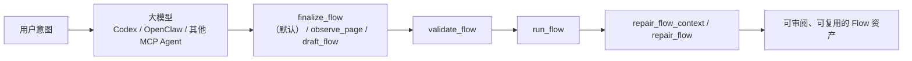

# TSPlay AI 无感入门：如何让用户通过大模型驱动 TSPlay

这篇教程解决的不是“如何手写一条 Flow”，而是更贴近真实落地的问题：

- 用户不想先学 Flow 语法
- 用户不想自己找 selector
- 用户更习惯对大模型说“我想做什么”
- 团队又希望最终沉淀成可审阅、可复用、可修复的自动化资产

TSPlay 的价值就在这里：让大模型不要直接硬写浏览器脚本，而是通过 MCP 工具链把用户意图逐步收敛成稳定 Flow。

## 适合谁

- 业务用户：想先把事情做成，再慢慢理解底层
- 测试 / 运营 / 实施同学：希望通过自然语言驱动浏览器自动化
- AI / 平台工程师：要把 Codex、OpenClaw 或其他支持 MCP 的模型接入 TSPlay
- 交付团队：希望把“大模型帮我做一次”变成“仓库里保留一条可维护 Flow”

## 一句话理解整体链路

用户不是直接驱动浏览器，而是通过大模型驱动 TSPlay 的 MCP 工具。



推荐闭环是：

`finalize_flow -> run_flow -> repair_flow_context -> repair_flow`

需要更细粒度控制时，再切换到：

`observe_page -> draft_flow -> validate_flow -> run_flow -> repair_flow_context -> repair_flow`

## 用户最少需要提供什么

理想情况下，用户只需要告诉模型 4 件事：

- 页面在哪：URL
- 想做什么：例如“搜索订单并导出”“上传文件并提交”
- 输入是什么：关键词、文件、筛选条件、账号角色
- 授权边界：是否允许文件访问、登录态复用、HTTP、数据库

通常不需要用户自己提供：

- selector
- Flow 骨架
- 页面 DOM
- 校验命令
- 失败修复策略

## 两种接入方式

### 方式 A：模型直接连 TSPlay MCP

这是最推荐的方式。模型能直接调用 TSPlay 工具，体验最顺滑。

适合：

- Codex
- OpenClaw
- 任何支持 MCP tool calling 的 Agent 框架

### 方式 B：人工中转

如果当前平台还没接 MCP，也可以先让人手动中转：

1. 用户把目标告诉大模型
2. 大模型输出建议的 TSPlay MCP 调用参数
3. 你手动执行或封装执行
4. 再把结果贴回给模型继续推进

这种方式不如直接连 MCP 顺畅，但仍然适合验证流程设计和提示词。

## 5 分钟跑通

### 1. 启动 TSPlay MCP

本地推荐优先用 `stdio`：

```bash
go run . -action mcp-stdio -flow-root script -artifact-root artifacts
```

如果你要用 sidecar 或远端方式，也可以用 HTTP：

```bash
go run . -action srv -addr :8081 -flow-root script -artifact-root artifacts
```

说明：

- `flow_path` 默认只允许读取 `script/`
- 文件读写默认只允许在 `artifact-root` 下进行
- 浏览器类工具会把运行记录写进 `artifacts/`

### 2. 如果要练仓库里的 demo 页面

用任意静态文件服务把 `demo/` 目录跑起来，例如：

```bash
python3 -m http.server 8000
```

然后可以访问：

- [../../demo/demo.html](../../demo/demo.html)
- [../../demo/tables.html](../../demo/tables.html)
- [../../demo/upload.html](../../demo/upload.html)
- [../../demo/multi_upfile.html](../../demo/multi_upfile.html)

如果你是用本地静态服务器，模型里更适合引用这类 URL：

- `http://127.0.0.1:8000/demo/demo.html`
- `http://127.0.0.1:8000/demo/tables.html`
- `http://127.0.0.1:8000/demo/upload.html`

### 3. 给模型一段固定工作指令

推荐把下面这段话配置成模型的 system prompt 或工作提示词：

```text
你现在是 TSPlay Flow 助手，目标是让用户只通过自然语言描述任务，而不是手写 selector 或 Flow。

工作原则：
1. 先使用 tsplay.flow_schema 和 tsplay.flow_examples 获取约束，不要靠猜。
2. 默认优先使用 tsplay.finalize_flow；只有在需要更细粒度控制时再回退到 tsplay.draft_flow。
3. 页面复杂、selector 不确定、或 draft / finalize 返回 unresolved/warnings 时，再使用 tsplay.observe_page。
4. 永远检查 status、validation、issue、repair_hints、warnings、unresolved，不要把草稿直接当成最终答案。
5. 成功前按 finalize / validate -> run -> repair 的顺序推进。
6. 只在确实需要时申请 security_preset 或 allow_* 授权，默认采用最小授权。
7. 如果场景依赖登录态，优先建议 tsplay.save_session，并在 Flow 顶层使用 browser.use_session。
8. 对用户输出时，优先说明“现在能做什么”“还缺什么输入/授权”“下一步要执行什么”，不要要求用户理解 selector 细节。
9. 最终尽量沉淀成可审阅 Flow，而不是停留在一次性对话结果。
```

### 4. 用户可以直接这样提需求

```text
帮我在 <URL> 上完成下面的任务：
- 目标：<我想做什么>
- 输入：<关键词 / 文件 / 条件>
- 结果要求：<我希望拿到什么结果>
- 授权说明：<是否允许文件访问、登录态、HTTP、数据库>
```

例如：

```text
帮我在 http://127.0.0.1:8000/demo/tables.html 上提取表格数据。
- 目标：抓取表头和所有行
- 输入：无
- 结果要求：给我一条可运行的 Flow，并执行一次
- 授权说明：只允许普通页面读取，不允许文件写入
```

## 模型应该如何推进

当用户只给出“意图 + URL + 输入 + 授权边界”时，模型推荐按这个顺序工作：

1. 调 `tsplay.finalize_flow`
2. 看 `status`、`validation`、`issue`、`repair_hints`、`warnings`、`unresolved`
3. 如果 `status=ready`，直接调 `tsplay.run_flow`
4. 如果 `status=needs_permission`，先解释授权，再补 `security_preset` / `allow_*`
5. 如果 `status=needs_input`，先补输入，再重新 `tsplay.finalize_flow`
6. 如果 `status=needs_repair`，再进入 `tsplay.validate_flow`
7. 页面复杂或需要单独观察时再调 `tsplay.observe_page`
8. 失败时调 `tsplay.repair_flow_context`
9. 再调 `tsplay.repair_flow`
10. 产出更新后的 Flow，再次 `validate_flow` / `run_flow`

这条顺序的价值是：

- 用户不必自己找 selector
- `finalize_flow` 能直接把“能不能跑、缺什么”收敛成一个状态
- `draft_flow` 仍然会自动做一轮校验和 selector 修正
- 修复上下文不会把整页 HTML 原样丢给模型
- 最终留下的是 Flow 资产，不是一次性的对话产物

## 一条最小闭环的 MCP 调用样例

下面这组参数很适合平台接入、联调或教学演示时参考。

### 1. 一步式 finalize

```json
{
  "intent": "提取页面里的表格数据",
  "url": "http://127.0.0.1:8000/demo/tables.html",
  "security_preset": "readonly"
}
```

期待模型关注：

- `status`
- `flow_yaml`
- `validation`
- `issue`
- `summary`
- `next_action`

### 2. 草拟 Flow（需要细粒度控制时）

```json
{
  "intent": "提取页面里的表格数据",
  "url": "http://127.0.0.1:8000/demo/tables.html",
  "security_preset": "readonly"
}
```

期待模型关注：

- `draft.flow_yaml`
- `draft.validation`
- `summary`
- `next_action`

### 3. 单独校验

```json
{
  "flow": "schema_version: \"1\"\nname: extract_table\nsteps:\n  - action: navigate\n    url: http://127.0.0.1:8000/demo/tables.html\n  - action: capture_table\n    selector: \"table\"\n    save_as: table_data\n",
  "format": "yaml",
  "security_preset": "readonly"
}
```

期待模型关注：

- `valid`
- `error`
- `security`
- `next_action`

### 4. 执行 Flow

```json
{
  "flow": "schema_version: \"1\"\nname: extract_table\nsteps:\n  - action: navigate\n    url: http://127.0.0.1:8000/demo/tables.html\n  - action: capture_table\n    selector: \"table\"\n    save_as: table_data\n",
  "format": "yaml",
  "headless": true,
  "security_preset": "readonly"
}
```

期待模型关注：

- `result.trace`
- `result.vars`
- `run`
- `artifacts`

### 5. 失败后构建修复上下文

```json
{
  "flow": "schema_version: \"1\"\nname: broken_flow\nsteps:\n  - action: navigate\n    url: http://127.0.0.1:8000/demo/demo.html\n  - action: click\n    selector: \"#missing-button\"\n",
  "format": "yaml",
  "run_result": "<直接传入 tsplay.run_flow 的返回 JSON>"
}
```

期待模型关注：

- `context.failed_step`
- `context.failure_category`
- `context.repair_hints`
- `context.artifacts`

### 6. 让模型生成修复提示

```json
{
  "flow": "schema_version: \"1\"\nname: broken_flow\nsteps:\n  - action: navigate\n    url: http://127.0.0.1:8000/demo/demo.html\n  - action: click\n    selector: \"#missing-button\"\n",
  "format": "yaml",
  "repair_context": "<直接传入 tsplay.repair_flow_context 返回的 context JSON>"
}
```

期待模型关注：

- `repair.prompt`
- `repair.target_steps`
- `next_action`

## TSPlay 的几个关键输出，模型必须会看

### `finalize_flow`

重点看：

- `status`
- `flow_yaml`
- `validation`
- `issue`
- `suggested_vars`
- `summary`
- `next_action`

真实返回示例（节选）：

```json
{
  "ok": true,
  "tool": "tsplay.finalize_flow",
  "status": "needs_input",
  "flow_yaml": "schema_version: \"1\"\nname: order_search_from_observation\nvars:\n  target_url: https://example.com/orders\n  query_text: TODO\nsteps:\n  - action: navigate\n    url: \"{{target_url}}\"\n  - action: type_text\n    selector: '[data-testid=\"order-query\"]'\n    text: \"{{query_text}}\"\n  - action: click\n    selector: 'text=\"Search\"'\n",
  "validation": {
    "valid": true,
    "name": "order_search_from_observation",
    "steps": 3
  },
  "suggested_vars": {
    "target_url": "https://example.com/orders",
    "query_text": "TODO"
  },
  "next_action": {
    "tool": "tsplay.finalize_flow",
    "reason": "Fill the remaining TODO variables or unresolved inputs, then finalize again."
  }
}
```

### `draft_flow`

重点看：

- `draft.flow_yaml`
- `draft.validation`
- `draft.validation.issue`
- `draft.repair_hints`
- `draft.warnings`
- `draft.unresolved`
- `summary`
- `next_action`

真实返回示例（节选）：

```json
{
  "ok": true,
  "tool": "tsplay.draft_flow",
  "summary": "Drafted flow \"upload_from_observation\" with 2 planned actions.",
  "issue": {
    "code": "security_policy",
    "step_path": "3",
    "action": "upload_file",
    "field": "allow_file_access",
    "suggestion": "Retry with allow_file_access=true only if this is a trusted flow."
  },
  "draft": {
    "flow_name": "upload_from_observation",
    "validation": {
      "valid": false,
      "error": "step 3 action \"upload_file\" is disabled by security policy; set allow_file_access=true only for trusted flows",
      "issue": {
        "code": "security_policy",
        "step_path": "3",
        "action": "upload_file",
        "field": "allow_file_access"
      }
    },
    "repair_hints": [
      {
        "step_path": "3",
        "failure_category": "validation",
        "suggestion": "Inspect step 3 first. If this is a trusted automation, rerun draft_flow or validate_flow with allow_file_access=true; otherwise replace the step with a lower-risk action."
      }
    ]
  }
}
```

### `validate_flow`

重点看：

- `valid`
- `error`
- `issue`
- `security`
- `next_action`

## 常见误写 -> issue -> 修复方式

| 常见误写 | 常见 issue 输出 | 推荐修复 |
| --- | --- | --- |
| `action: fill` | `unsupported_action` + `did_you_mean=type_text` | 改成 `type_text` |
| `result_var: rows` | `unknown_field` + `did_you_mean=save_as` | 改成 `save_as: rows` |
| `with.headers:` 写成顶层字段 | `unknown_field` + `field=with.headers` | 改成 `with: { headers: [...] }` |
| `navigate.timeout` | `unexpected_parameter` + `field=timeout` | 改用 `browser.timeout` 或 MCP 工具超时 |
| `action: save_file` | `unsupported_action` | 按产物类型改用 `write_json` / `write_csv` / `save_html` |
| `action: log` | `unsupported_action` | 把提示放到调用方，或用 `set_var` / `append_var` 保存状态 |

### `run_flow`

重点看：

- `result.trace`
- `result.vars`
- `run`
- `artifacts`
- `next_action`

### `repair_flow_context`

重点看：

- `context.failed_step`
- `context.failure_category`
- `context.repair_hints`
- `context.artifacts`
- `next_action`

## 授权怎么讲给用户听

“让用户通过大模型驱动”不代表把权限全开。

推荐优先用 `security_preset`，而不是一上来堆满 `allow_*`：

| 方式 | 适合场景 |
| --- | --- |
| `readonly` | 页面观察、文本提取、普通校验 |
| `browser_write` | 上传、下载、截图、HTML 保存、Storage State 复用 |
| `full_automation` | HTTP、Redis、数据库、Lua、JavaScript 等全能力场景 |

如果需要更细粒度控制，再额外叠加：

- `allow_file_access`
- `allow_browser_state`
- `allow_http`
- `allow_redis`
- `allow_database`
- `allow_lua`
- `allow_javascript`

给用户的解释建议尽量业务化，不要只说技术名词。比如：

- 不说：“需要 `allow_file_access`”
- 更适合说：“这一步要上传文件，所以需要允许模型在受控目录内读取文件”

## 三条完整实战链路

### 场景 1：提取表格

用户输入：

```text
帮我在 http://127.0.0.1:8000/demo/tables.html 上提取表格数据。
- 目标：抓取表头和所有行
- 输入：无
- 结果要求：给我一条可运行 Flow，并执行一次
- 授权说明：readonly
```

模型理想动作：

1. `finalize_flow`
2. 读取 `status` 和 `validation`
3. `status=ready` 后 `run_flow`

模型对用户的理想输出：

- 已生成一条 Flow
- 已执行一次
- 共抓取多少行
- 如果你愿意，可以把这条 Flow 继续沉淀成回归脚本

### 场景 2：上传文件并提交

用户输入：

```text
帮我在 http://127.0.0.1:8000/demo/upload.html 上上传一个文件并提交。
- 输入：/absolute/path/to/file.csv
- 结果要求：给我一条 Flow，并在我确认授权后执行
- 授权说明：先不要默认开高风险权限
```

模型理想动作：

1. `finalize_flow`
2. 从 `status=needs_permission` 和 `issue` 识别出需要文件权限
3. 向用户说明需要 `browser_write` 或 `allow_file_access`
4. 用户确认后再次 `finalize_flow`
5. 再 `run_flow`

模型对用户的理想输出：

- 草稿已经生成
- 当前阻塞点是文件授权，不是 Flow 结构问题
- 一旦确认授权即可继续执行

### 场景 3：带登录态的业务流程

用户输入：

```text
帮我登录后台后搜索订单并导出，后面这个流程还会重复执行。
```

模型理想动作：

1. 先问清登录方式和可否保存登录态
2. 首次执行后用 `tsplay.save_session` 保存会话
3. 后续 Flow 顶层使用 `browser.use_session`
4. 再进行 `draft -> validate -> run`

这个场景的关键不是“第一次跑通”，而是把登录态沉淀成可复用资产。

## 用户与模型的推荐对话模板

### 模板 1：最短可用

```text
帮我在 <URL> 上做 <目标>。
输入是：<输入>
我希望最终拿到：<结果>
你先用 TSPlay MCP 草拟并校验，必要时再执行。
```

### 模板 2：带授权边界

```text
帮我在 <URL> 上完成 <目标>。
输入是：<输入>
结果要求：<结果>
授权边界：
- 文件访问：允许 / 不允许
- 登录态复用：允许 / 不允许
- HTTP：允许 / 不允许
- 数据库：允许 / 不允许
请按 TSPlay 的 observe -> draft -> validate -> run -> repair 流程推进。
```

### 模板 3：要求模型更像“助手”而不是“解释器”

```text
你不用先给我讲底层原理，先帮我把事情做成。
如果缺输入或授权，只告诉我最关键的一项。
如果失败，先自己用 TSPlay 的 repair 工具链收敛一轮，再告诉我需要我补什么。
```

## 失败时怎么保持“无感”

好的“无感体验”不是永不失败，而是失败时用户也不用自己排底层细节。

模型在失败后应这样处理：

1. 用一句话告诉用户失败在哪一步
2. 调 `tsplay.repair_flow_context`
3. 根据 `repair_hints` 调 `tsplay.repair_flow`
4. 更新 Flow
5. 重新 `validate_flow`
6. 必要时重新 `run_flow`

模型对用户的输出重点应是：

- 哪一步失败了
- AI 准备怎么修
- 现在缺的是输入、授权，还是页面变化

而不是直接把整段 trace 或 HTML 扔给用户。

## 给平台 / Agent 集成同学的建议

如果你是在做产品或平台集成，建议优先把这些能力固定下来：

- 默认工作流：`draft -> validate -> run -> repair`
- 默认安全策略：从 `readonly` 起步，按需升级到 `browser_write`
- 默认展示字段：`summary`, `warnings`, `next_action`, `run`
- 默认沉淀资产：保留 `flow_yaml`、运行 trace、artifacts、会话信息

最理想的用户界面，不需要让用户理解太多底层概念，只暴露这些信息：

- 我想做什么
- 我给什么输入
- 是否同意某类授权
- 当前结果如何
- 下一步建议是什么

## 常见误区

### 误区 1：让模型直接手写 selector

更好的做法是优先让它调 `finalize_flow`；需要更细粒度控制时再调 `draft_flow` 或 `observe_page`。

### 误区 2：一开始就把所有权限全开

更好的做法是默认 `readonly`，按需提升到 `browser_write` 或 `full_automation`。

### 误区 3：只保留对话，不保留 Flow

更好的做法是把最终 Flow 存下来，作为团队资产。

### 误区 4：失败后立刻让用户自己看 DOM

更好的做法是先走 `repair_flow_context` / `repair_flow` 闭环，再决定要不要向用户追问。

## 一份适合产品化落地的最小清单

如果你想把“用户通过大模型驱动 TSPlay”做成一个稳定能力，建议至少具备这些配置：

- 一个可用的 TSPlay MCP Server
- 一段固定的 system prompt
- 一套统一的用户输入模板
- 一个默认安全策略
- 一条固定的失败修复闭环
- 一个保存最终 Flow 和 artifacts 的地方

## 推荐阅读顺序

建议按这个顺序看：

1. [../../ReadMe.md](../../ReadMe.md) 的 MCP 章节
2. 本文
3. [labs.md](labs.md) 里的 Lab 6
4. [capstone-briefs.md](capstone-briefs.md) 里的 MCP 场景

如果之后需要补底层理解，再继续看：

- [learning-path.md](learning-path.md)
- [trainer-playbook.md](trainer-playbook.md)
